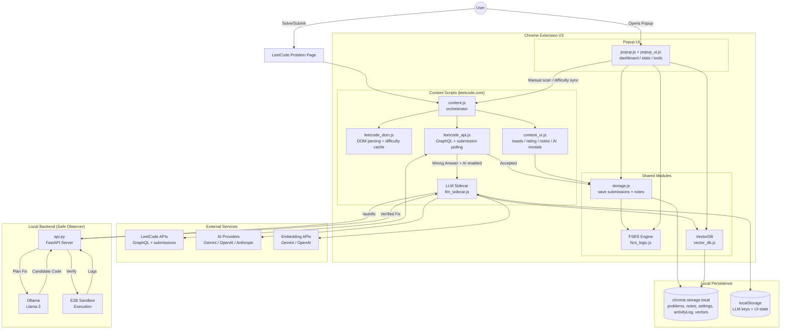
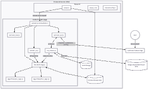

# LeetCode EasyRepeat

A Chrome Extension that helps you master LeetCode problems using a **Spaced Repetition System (SRS)**. It automatically tracks your "Accepted" submissions, schedules reviews based on the **FSRS v4.5 algorithm**, and features a stunning cyberpunk-inspired UI with customizable themes.


## ✨ Features

### 🧠 Spaced Repetition (FSRS v4.5 Algorithm)
- **Automatic Submission Detection**: Captures "Accepted" submissions directly on LeetCode
- **Smart Scheduling**: Uses the state-of-the-art **FSRS v4.5** algorithm with optimized weights for superior retention modeling
- **Stability & Difficulty Modeling**: Dynamically adjusts stability and difficulty based on your performance
- **Problem Difficulty Tracking**: Automatically detects and saves LeetCode difficulty (Easy/Medium/Hard)

### 🎨 Cyberpunk UI with Dual Themes
- **Sakura Theme** (Default): Lesbian flag-inspired color palette with neon peach, pink, and orange glows
- **Matrix Theme**: Classic green terminal aesthetic with electric cyan accents
- **Dynamic Theme Switching**: Toggle themes with one click; preference is saved across sessions
- **Themed Toast Notifications**: In-page success toasts match your selected theme

### 📊 Visual Dashboard
- **Cognitive Retention Heatmap**: Global activity visualization showing your practice patterns
- **Mini Projection Timelines**: Each problem card shows projected future review dates
- **Vector Cards**: Expandable problem cards displaying:
  - Problem title and difficulty
  - Current interval and repetition count
  - Again/Hard/Good/Easy rating buttons (FSRS)
  - Direct link to the problem

### 📝 Contextual Notes
- **Floating Notes Button**: Quickly jot down your thoughts, algorithms, or key insights for any problem without leaving the page.
- **Draggable Interface**: Long-press (0.4s) the "Notes" button to drag and reposition it anywhere on your screen.
- **Smart Helpers**: Helpful tooltips guide you on valid interactions (like how to drag).
- **Auto-Sync**: Notes are automatically saved to Chrome Storage and synced with the problem.

### ⚙️ Advanced Tools
- **Manual Scan**: Force-scan the current page for accepted submissions
- **Simulation Mode**: Test mode with date override for debugging your review schedule
- **Purge Memory**: Reset all stored data with one click
- **Live Clock**: Real-time system clock in the status bar

### 🔬 Robust Detection
- **API-Based Verification**: Polls LeetCode's internal API to confirm submissions, ignoring UI layout glitches
- **Infinite Loop Protection**: Safeguard against corrupted data causing browser freezes
- **Resilience**: Comprehensive error handling to prevent "Context Lost" extension crashes
- **SPA Navigation Aware**: Handles LeetCode's single-page-app navigation correctly
- **Difficulty Caching**: Pre-caches difficulty before submission to handle DOM changes

### 🛡️ Autonomous Auto-Fix Agent
- **Multi-Turn Self-Correction**: Automatically iterates on buggy solutions up to 3 times, refining the code based on sandbox error logs.
- **Agentic Test Generation**: Generates 3+ custom edge-case tests (e.g., empty inputs, large numbers) to rigorously verify fixes beyond the standard failing case.
- **Safe Observer Sandbox**: Executes candidate fixes in an isolated E2B sandbox to ensure safety and correctness before suggesting them.
- **Thought Signature**: Displays the number of attempts and test coverage (e.g., "Passed 4/4 Tests") directly in the UI.

### 🧠 Neural Retention Agent (New!)
A personalized learning assistant that builds a "Skill DNA" profile of your coding strengths and weaknesses.

- **Two-Layer Skill Taxonomy**:
  - **Layer 1 (LeetCode Tags)**: Tracks performance by topic (Binary Search, Dynamic Programming, etc.)
  - **Layer 2 (Error Patterns)**: Detects recurring mistakes (off-by-one, null-check-missing, etc.)
  
- **Nightly Digest Engine**: Runs at 2am to analyze your daily practice and update your Skill DNA

- **Personalized Micro-Drills**: Generates targeted practice exercises for your weak areas:
  - **Fill-in-the-blank**: Complete missing code
  - **Spot-the-bug**: Find errors in code snippets
  - **Muscle-memory**: Write code patterns from memory

- **Backfill Agent**: Automatically fetches LeetCode tags for problems missing metadata (rate-limited to avoid bans)

- **Settings Page**: Configure digest time, error pattern threshold, and notification preferences

---


## 🚀 Quick Setup

Before loading the extension or running tests, install dependencies:

```bash
npm install
```

> **Why?** This project uses external libraries (like Jest for testing and jsdom for simulation) which are not stored in the repository.

---

## 📥 How to Install in Chrome

1. Open Chrome and navigate to `chrome://extensions/`
2. Enable **Developer mode** (toggle in the top-right corner)
3. Click **Load unpacked**
4. Select this entire folder (`leetcode-srs-extension`)

---

## 🛡️ Safe Observer Setup (Local Backend)

To enable the AI "Safe Observer" feature (real code execution verification), you must run the local verification server.

1.  **Prerequisites**:
    - Python 3.x installed
    - Pip installed

2.  **Installation**:
    Navigate to the `mcp-server` directory and install dependencies:
    ```bash
    cd mcp-server
    pip install -r requirements.txt
    ```

3.  **Configuration**:
    Create a `.env` file in the `mcp-server` directory with your E2B API Key:
    ```bash
    E2B_API_KEY=your_api_key_here
    ```

4.  **Running the Server**:
    Start the FastAPI server:
    ```bash
    python api.py
    # Server running at http://0.0.0.0:8000
    ```

5.  **Usage**:
    The Chrome Extension will automatically detect the running server at `http://localhost:8000` and use it to verify buggy solutions.

---

## 🛠 Usage

### Automatic Tracking
Just solve problems on LeetCode! When you see "Accepted", the extension automatically saves the result and shows a themed toast notification.

### Manual Review
Click the extension icon to see:
- Problems due for review today
- All tracked problems
- Rating buttons to adjust difficulty

### SRS Rating
- **Again** → Review very soon (stability decreases significantly)
- **Hard** → Review sooner (lower stability increase)
- **Good** → Standard progression (optimal retention)
- **Easy** → Push review far into the future (higher stability)

### Sidebar Navigation

| Icon | Function |
|------|----------|
| 📊 Dashboard | View problems due today |
| 📈 All Vectors | View all tracked problems |
| 🔍 Scan | Manual page scan |
| 🗑️ Purge | Clear all data |
| ☀️ Theme | Toggle Sakura/Matrix theme |

---

## 🧪 Running Tests

The project includes comprehensive unit tests covering:
- **FSRS Logic**: Stability/difficulty calculations, interval scheduling, retrievability
- **API Integration**: Mocked tests for submission polling and status verification
- **DOM Detection**: Problem extraction, difficulty parsing
- **VectorDB & RAG**: Embedding storage and similarity search
- **E2E Tests**: Puppeteer-based end-to-end browser testing (requires Chrome)

```bash
# Run all tests
npm test

# Run tests with coverage
npx jest --coverage
```

---

## 📁 Project Structure

```
leetcode-srs-extension/
├── manifest.json          # Chrome extension configuration (Manifest V3)
├── src/
│   ├── content/           # Content scripts (runs on leetcode.com)
│   │   ├── content.js     # Orchestrator
│   │   ├── content_ui.js  # Toasts, rating modal, notes widget
│   │   ├── leetcode_api.js # GraphQL + submission polling
│   │   ├── leetcode_dom.js # DOM parsing + difficulty cache
│   │   ├── llm_sidecar.js # LLM/RAG/Auto-Fix integration
│   │   ├── shadow_logger.js # Debug logging
│   │   └── morning_greeting.js # Neural Agent greeting banner
│   ├── popup/             # Extension popup UI
│   │   ├── popup.html
│   │   ├── popup.js       # Dashboard + Neural Agent tab
│   │   ├── popup_ui.js
│   │   └── popup.css
│   ├── drills/            # Micro-drill practice system
│   │   ├── drills.html    # Drill practice page
│   │   ├── drill_init.js  # Drill page controller
│   │   ├── drill_page.js  # Drill rendering
│   │   └── drill_queue.js # Queue UI component
│   ├── algorithms/        # SRS algorithms
│   │   ├── fsrs_logic.js  # FSRS v4.5 (primary)
│   │   └── srs_logic.js   # SM-2 (legacy fallback)
│   ├── shared/            # Shared utilities
│   │   ├── storage.js     # Chrome storage wrapper
│   │   └── vector_db.js   # Client-side VectorDB
│   ├── background/        # Service worker + Neural Agent modules
│   │   ├── background.js  # Main service worker
│   │   ├── skill_matrix.js # Skill DNA tracking
│   │   ├── drill_generator.js # AI-powered drill creation
│   │   ├── drill_store.js # IndexedDB for drills
│   │   ├── digest_orchestrator.js # Nightly analysis
│   │   ├── error_pattern_detector.js # Layer 2 patterns
│   │   └── backfill_agent.js # Tag fetcher
│   ├── options/           # Settings page
│   │   ├── options.html
│   │   └── options.js
│   └── data/              # Static data
│       └── skill_taxonomy.json
├── mcp-server/            # Local Auto-Fix server (Python)
├── tests/                 # Jest tests (40+ files)
└── assets/                # Icons and images
```

---

## 🔧 Technical Challenges & Robustness

Building a reliable agentic extension on top of non-deterministic LLMs presented unique engineering challenges. This project implements several architectural patterns to ensure stability.

### 1. Handling LLM Hallucinations (Fault Isolation)
LLMs occasionally fail to follow strict output schemas (like JSON), even with careful prompting. A naive implementation would crash if the model returned malformed data for a single request.

**Our Solution: Component-Level Fault Tolerance**
The system treats every AI operation as an isolated transaction. In the `Drill Generator` workflow:
- The system iterates through multiple user "weak skills" (e.g., *Dynamic Programming*, *Graphs*).
- Each skill generation is wrapped in a "Safe Guard" pattern.
- **Real-World Example:** If the model acts up while generating *Graph* drills (returning invalid JSON), the system catches the error, logs a warning, and **seamlessly proceeds** to generate drills for *Dynamic Programming*.
- This ensures the user always gets *some* value, rather than a broken loading spinner.

### 2. The "JSON-In-Markdown" Problem
LLMs trained for chat often wrap code in markdown backticks (```json ... ```), which breaks standard `JSON.parse()`.

**Our Solution: Heuristic Extraction Strategy**
We implemented a multi-pass parser in `GeminiClient`:
1.  **Strict Mode:** Enforce `response_mime_type: "application/json"` in the API request (for models that support it).
2.  **Pattern Matching:** Regex extraction of content within markdown code blocks.
3.  **Boundary Search:** Fallback logic that locates the outermost `{` and `}` to extract valid JSON objects from mixed-text responses.

### 3. Graceful Degradation (The Fallback Ladder)
The system is designed never to leave the user empty-handed.
1.  **Tier 1 (Best):** Personalized drills generated live by Gemini based on recent mistakes.
2.  **Tier 2 (Fallback):** If the API is unreachable (or offline), use "Skill DNA" patterns stored locally to select pre-written templates.
3.  **Tier 3 (Safety):** If no history exists, provide curated "Demo" drills to showcase functionality.

This ladder ensures the extension is functional immediately upon installation, even before the user configures their API keys.

---

## 🔧 Technical Details

### FSRS v4.5 Algorithm
The extension implements the **Free Spaced Repetition Scheduler (FSRS) v4.5**, a modern algorithm that outperforms SM-2:
- **Stability-based Scheduling**: Uses a forgetting curve model with optimized weights trained on large datasets
- **Difficulty Modeling**: Tracks per-problem difficulty (1-10) with automatic adjustment
- **Retrievability Calculation**: Predicts your probability of recall at any given time
- **Formula**: `Interval = Stability / FACTOR * (R^(1/DECAY) - 1)` where R=0.9 (target retention)

### Architecture



### AI Mistake Analysis Architecture



### AI Analysis Workflow Strategy

The following sequence diagram details the decision-making process for analyzing user mistakes, optimizing for speed and cost by prioritizing cached solutions (RAG) before attempting expensive verification (Auto-Fix).

```mermaid
sequenceDiagram
    participant User
    participant Sidecar as LLM Sidecar<br/>(llm_sidecar.js)
    participant RAG as VectorDB<br/>(vector_db.js)
    participant API as MCP Server<br/>(api.py)
    participant Sandbox as E2B Sandbox<br/>(server.py)
    participant LLM as AI Model<br/>(Cloud/Local)

    User->>Sidecar: 1. Submits Wrong Answer
    Note over Sidecar: llm_sidecar.js:385

    rect rgb(20, 20, 30)
        note right of Sidecar: Phase 1: Knowledge Retrieval
        Sidecar->>RAG: 2. Search Similar Mistakes
        RAG-->>Sidecar: Return Matches (Score 0-1)
        Note over Sidecar: llm_sidecar.js:400
    end

    alt High Confidence Match (> 92%)
        Sidecar->>User: 3a. Return Cached Advice IMMEDIATE
        Note over Sidecar, User: Skip Auto-Fix & LLM Call
    else Low Confidence
        rect rgb(40, 20, 20)
            note right of Sidecar: Phase 2: Safe Observer (Auto-Fix)
            Sidecar->>API: 3b. Request Auto-Fix (/autofix)
            Note over Sidecar: llm_sidecar.js:450
            API->>LLM: Generate Candidate Fix
            LLM-->>API: Python Code
            API->>Sandbox: Verify Fix (server.py)
            Sandbox-->>API: Execution Logs
            API-->>Sidecar: Verified Code + Logs
        end

        rect rgb(20, 20, 40)
            note right of Sidecar: Phase 3: Final Analysis
            Sidecar->>LLM: 4. Analyze with Context (RAG + Verification)
            LLM-->>Sidecar: Final Explanation JSON
            Sidecar->>User: 5. Display Analysis
        end
    end
```



### Storage
Uses Chrome's `chrome.storage.local` API to persist:
- Problem data (title, slug, difficulty, stability, difficulty score, state)
- Theme preference
- Activity log for streak tracking
- Vector embeddings for RAG

### Detection Strategy
1. **Passive**: MutationObserver watches for DOM changes
2. **Active**: Click listener on Submit button triggers polling
3. **Polling**: Checks for "Accepted" text/color every 500ms after submission
4. **Fallback**: Manual scan via popup

---

## 📝 License

MIT License - feel free to modify and distribute!
