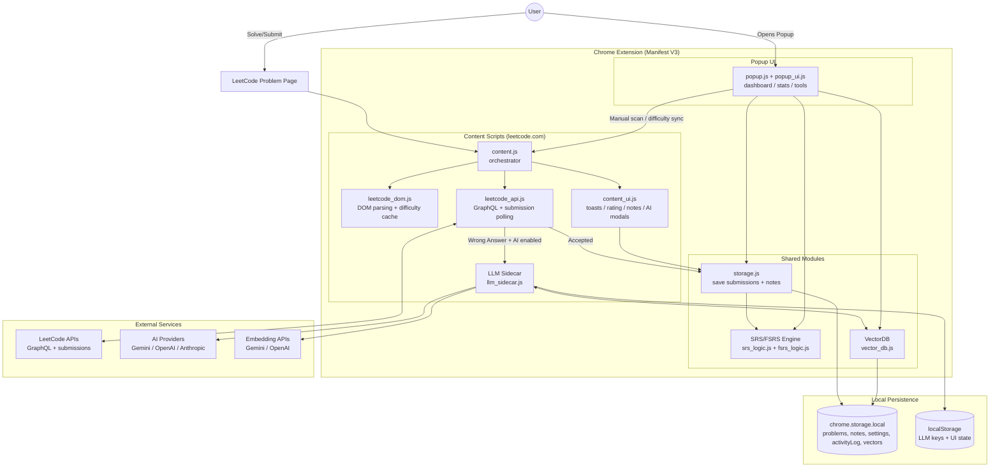

# LeetCode EasyRepeat

A Chrome Extension that helps you master LeetCode problems using a **Spaced Repetition System (SRS)**. It automatically tracks your "Accepted" submissions, schedules reviews based on the SM-2 algorithm, and features a stunning cyberpunk-inspired UI with customizable themes.


## ✨ Features

### 🧠 Spaced Repetition (SM-2 Algorithm)
- **Automatic Submission Detection**: Captures "Accepted" submissions directly on LeetCode
- **Smart Scheduling**: Uses the scientifically-proven SM-2 algorithm to calculate optimal review intervals
- **Ease Factor Adjustment**: Rate problems as **Easy**, **Medium**, or **Hard** to personalize your review schedule
- **Problem Difficulty Tracking**: Automatically detects and saves LeetCode difficulty (Easy/Medium/Hard)

### 🎨 Cyberpunk UI with Dual Themes
- **Sakura Theme** (Default): Lesbian flag-inspired color palette with neon peach, pink, and orange glows
- **Matrix Theme**: Classic green terminal aesthetic with electric cyan accents
- **Dynamic Theme Switching**: Toggle themes with one click; preference is saved across sessions
- **Themed Toast Notifications**: In-page success toasts match your selected theme

### 📊 Visual Dashboard
- **Cognitive Retention Heatmap**: Global activity visualization showing your practice patterns
- **Mini Projection Timelines**: Each problem card shows projected future review dates
- **Vector Cards**: Expandable problem cards displaying:
  - Problem title and difficulty
  - Current interval and repetition count
  - Easy/Medium/Hard rating buttons
  - Easy/Medium/Hard rating buttons
  - Direct link to the problem

### 📝 Contextual Notes
- **Floating Notes Button**: Quickly jot down your thoughts, algorithms, or key insights for any problem without leaving the page.
- **Draggable Interface**: Long-press (0.4s) the "Notes" button to drag and reposition it anywhere on your screen.
- **Smart Helpers**: Helpful tooltips guide you on valid interactions (like how to drag).
- **Auto-Sync**: Notes are automatically saved to Chrome Storage and synced with the problem.

### ⚙️ Advanced Tools
- **Manual Scan**: Force-scan the current page for accepted submissions
- **Simulation Mode**: Test mode with date override for debugging your review schedule
- **Purge Memory**: Reset all stored data with one click
- **Live Clock**: Real-time system clock in the status bar

### 🔬 Robust Detection
- **API-Based Verification**: Polls LeetCode's internal API to confirm submissions, ignoring UI layout glitches
- **Infinite Loop Protection**: Safeguard against corrupted data causing browser freezes
- **Resilience**: Comprehensive error handling to prevent "Context Lost" extension crashes
- **SPA Navigation Aware**: Handles LeetCode's single-page-app navigation correctly
- **Difficulty Caching**: Pre-caches difficulty before submission to handle DOM changes

---

## 🚀 Quick Setup

Before loading the extension or running tests, install dependencies:

```bash
npm install
```

> **Why?** This project uses external libraries (like Jest for testing and jsdom for simulation) which are not stored in the repository.

---

## 📥 How to Install in Chrome

1. Open Chrome and navigate to `chrome://extensions/`
2. Enable **Developer mode** (toggle in the top-right corner)
3. Click **Load unpacked**
4. Select this entire folder (`leetcode-srs-extension`)

---

## 🛠 Usage

### Automatic Tracking
Just solve problems on LeetCode! When you see "Accepted", the extension automatically saves the result and shows a themed toast notification.

### Manual Review
Click the extension icon to see:
- Problems due for review today
- All tracked problems
- Rating buttons to adjust difficulty

### SRS Rating
- **Easy** → Push review far into the future (higher ease factor)
- **Medium** → Standard schedule progression
- **Hard** → Review sooner (lower ease factor)

### Sidebar Navigation

| Icon | Function |
|------|----------|
| 📊 Dashboard | View problems due today |
| 📈 All Vectors | View all tracked problems |
| 🔍 Scan | Manual page scan |
| 🗑️ Purge | Clear all data |
| ☀️ Theme | Toggle Sakura/Matrix theme |

---

## 🧪 Running Tests

The project includes comprehensive unit tests covering:
- **SRS Logic**: Interval calculations, repetition tracking, ease factors (including infinite loop resilience)
- **API Integration**: Mocked tests for submission polling and status verification
- **DOM Detection**: Problem extraction, difficulty parsing
- **E2E Tests**: Puppeteer-based end-to-end browser testing (requires Chrome)

```bash
# Run all tests
npm test

# Run tests with coverage
npx jest --coverage
```

---

## 📁 Project Structure

```
leetcode-srs-extension/
├── manifest.json      # Chrome extension configuration (Manifest V3)
├── content.js         # Runs on LeetCode pages - detects submissions
├── content.css        # Toast notification styles
├── popup.html         # Extension popup UI structure
├── popup.js           # Popup logic - dashboard, themes, ratings
├── popup.css          # Cyberpunk UI styles
├── srs_logic.js       # SM-2 algorithm implementation (UMD module)
├── tests/
│   ├── srs.test.js              # SRS logic unit tests
│   ├── dom.test.js              # DOM detection unit tests
│   ├── api_submission_check.test.js # API polling logic tests
│   ├── resilience.test.js       # Safety/Inf-loop protection tests
│   └── e2e.js                   # End-to-end Puppeteer tests
└── icons/             # Extension icons
```

---

## 🔧 Technical Details

### SM-2 Algorithm
The extension implements a modified SM-2 spaced repetition algorithm:
- First review: 1 day
- Second review: 6 days
- Subsequent reviews: `interval × ease_factor`
- Ease factor adjusts based on your difficulty ratings (1.3 - 2.5+)

### Architecture



### Storage
Uses Chrome's `chrome.storage.local` API to persist:
- Problem data (title, slug, difficulty, interval, repetition, ease factor)
- Theme preference
- Test mode state

### Detection Strategy
1. **Passive**: MutationObserver watches for DOM changes
2. **Active**: Click listener on Submit button triggers polling
3. **Polling**: Checks for "Accepted" text/color every 500ms after submission
4. **Fallback**: Manual scan via popup

---

## 📝 License

MIT License - feel free to modify and distribute!
