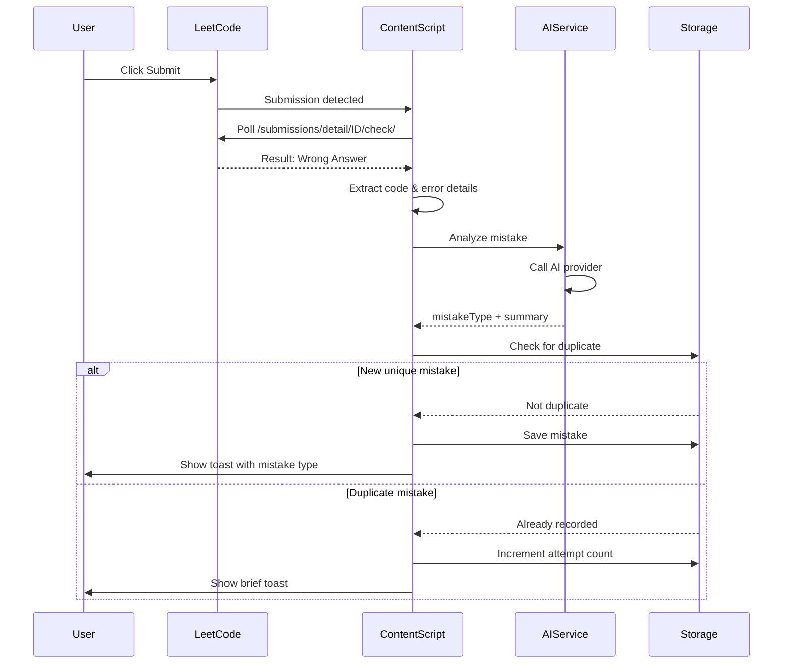
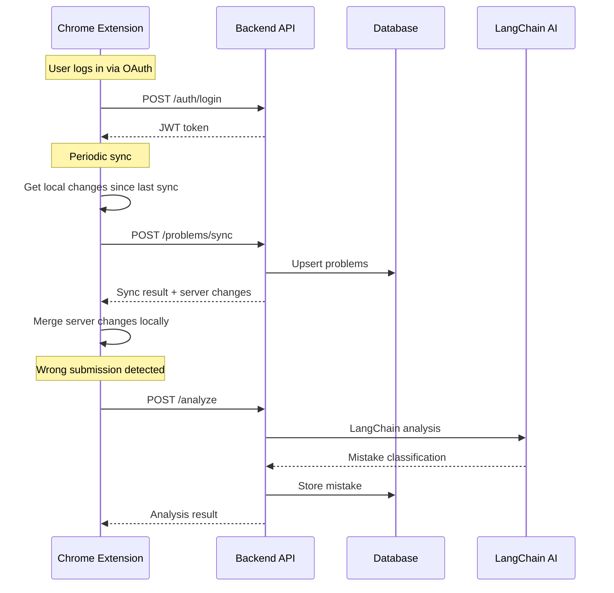

# LeetCode EasyRepeat - AI Mistake Analysis Architecture

## Overview

This document outlines the **Hybrid Architecture** for enhancing LeetCode EasyRepeat:

### Current Phase (Extension-Only)
1. **Question Topics** - Auto-fetched from LeetCode API
2. **Wrong Submission Capture** - Deduplicated, AI-summarized mistakes
3. **AI Mistake Classification** - Fixed taxonomy with 1-sentence summaries
4. **Weakness Visualization** - Topic-based and mistake-type graphs
5. **User-Provided AI Keys** - Gemini/OpenAI API keys stored locally

### Future Phase (Backend + Web Dashboard)
6. **Cloud Sync** - Cross-device synchronization
7. **Web Dashboard** - Rich analytics and visualizations
8. **Managed AI** - Backend handles AI calls (LangChain)
9. **Paid Tier** - Subscription for cloud features

**Key Principle**: Design data models and abstractions NOW that make backend integration seamless LATER.

---

## 1. Mistake Taxonomy (Fixed Categories)

### 1.1 Error Type Categories

```
MISTAKE_CAPTURE_MODE = "manual" // Default to manual/opt-in. User can enable "auto-analyze" in settings.
MISTAKE_TAXONOMY = {
  // Algorithm & Data Structure Mistakes
  "wrong-algorithm": "Used incorrect algorithm for the problem type",
  "suboptimal-complexity": "Solution works but exceeds time/space limits",
  "wrong-data-structure": "Used inappropriate data structure",
  
  // Logic Errors
  "off-by-one": "Index or boundary off by one",
  "wrong-condition": "Incorrect if/while condition logic",
  "wrong-operator": "Used wrong comparison or arithmetic operator",
  "infinite-loop": "Loop never terminates",
  "early-return": "Returned too early, missing cases",
  
  // Edge Cases
  "empty-input": "Failed to handle empty array/string/null",
  "single-element": "Failed to handle single element case",
  "duplicate-values": "Failed to handle duplicate elements",
  "negative-numbers": "Failed to handle negative values",
  "overflow": "Integer overflow not handled",
  "large-input": "Failed on large input size",
  
  // Syntax & Language
  "syntax-error": "Language syntax mistake",
  "type-error": "Wrong type usage or conversion",
  "null-reference": "Null/undefined reference access",
  
  // Problem Understanding
  "misread-problem": "Misunderstood problem requirements",
  "wrong-output-format": "Correct logic but wrong output format"
}
```

### 1.2 Topic Categories (from LeetCode)

Topics will be fetched automatically. Common ones include:
- Array, String, Hash Table, Two Pointers, Sliding Window
- Linked List, Stack, Queue, Tree, Graph
- Dynamic Programming, Greedy, Backtracking
- Binary Search, Sorting, Heap
- Math, Bit Manipulation, Design

---

## 2. Data Model Changes

### 2.1 Enhanced Problem Schema

```javascript
{
  problems: {
    "two-sum": {
      // Existing fields
      title: "1. Two Sum",
      slug: "two-sum",
      difficulty: "Easy",
      interval: 6,
      repetition: 2,
      easeFactor: 2.5,
      nextReviewDate: "2026-01-25T...",
      lastSolved: "2026-01-20T...",
      notes: "User notes...",
      history: [...],
      
      // NEW: Topics (auto-fetched)
      topics: ["Array", "Hash Table"],
      
      // NEW: Mistake Analysis
      mistakes: [
        {
          id: "m1",
          date: "2026-01-20T10:30:00Z",
          type: "off-by-one",           // From taxonomy
          summary: "Loop ended at i < n-1 instead of i < n, missing last element",
          submissionId: "123456789",    // LeetCode submission ID (optional)
          errorType: "Wrong Answer",    // LeetCode error type
          testCase: "Input: [1,2,3], Expected: 6, Got: 3"  // Optional
        },
        {
          id: "m2", 
          date: "2026-01-20T10:35:00Z",
          type: "empty-input",
          summary: "Did not check for empty array before accessing index 0",
          errorType: "Runtime Error"
        }
      ],
      
      // NEW: Aggregated Stats (computed)
      mistakeStats: {
        totalAttempts: 5,
        uniqueMistakeTypes: ["off-by-one", "empty-input"],
        lastAnalyzed: "2026-01-20T..."
      }
    }
  },
  
  // NEW: Global Settings
  settings: {
    aiProvider: "gemini",           // "gemini" | "openai" | "local" | "backend"
    aiApiKey: "encrypted_key...",   // User's API key (encrypted)
    aiModel: "gemini-1.5-flash",    // Model selection
    autoAnalyze: true,              // Auto-analyze on wrong submission
    theme: "sakura"
  },
  
  // NEW: Global Analytics (computed periodically)
  analytics: {
    weakTopics: [
      { topic: "Dynamic Programming", errorRate: 0.45, totalProblems: 20 },
      { topic: "Graph", errorRate: 0.38, totalProblems: 15 }
    ],
    commonMistakes: [
      { type: "off-by-one", count: 23, percentage: 0.18 },
      { type: "edge-case-empty", count: 19, percentage: 0.15 }
    ],
    lastUpdated: "2026-01-20T..."
  }
}
```

### 2.2 Deduplication Logic

When a new wrong submission comes in:

```javascript
async function shouldRecordMistake(problemSlug, newMistake) {
  const existing = problems[problemSlug].mistakes || [];
  
  // Check if same mistake type already recorded for this problem
  const duplicate = existing.find(m => 
    m.type === newMistake.type && 
    similarSummary(m.summary, newMistake.summary)
  );
  
  if (duplicate) {
    // Just increment attempt count, dont store again
    return false;
  }
  
  return true;
}

function similarSummary(a, b) {
  // Simple similarity check - could use embeddings later
  // For now: if >70% word overlap, consider similar
  const wordsA = new Set(a.toLowerCase().split(/\s+/));
  const wordsB = new Set(b.toLowerCase().split(/\s+/));
  const intersection = [...wordsA].filter(w => wordsB.has(w));
  return intersection.length / Math.max(wordsA.size, wordsB.size) > 0.7;
}
```

---

## 3. Architecture Diagram

```
┌─────────────────────────────────────────────────────────────────────────────┐
│                           CHROME EXTENSION                                   │
├─────────────────────────────────────────────────────────────────────────────┤
│                                                                              │
│  ┌──────────────────────────────────────────────────────────────────────┐   │
│  │                     CONTENT SCRIPTS (leetcode.com)                    │   │
│  │                                                                       │   │
│  │  ┌─────────────┐  ┌─────────────┐  ┌─────────────┐  ┌─────────────┐  │   │
│  │  │ leetcode_   │  │ leetcode_   │  │ submission_ │  │ content_    │  │   │
│  │  │ dom.js      │  │ api.js      │  │ capture.js  │  │ ui.js       │  │   │
│  │  │             │  │             │  │   [NEW]     │  │             │  │   │
│  │  │ - Extract   │  │ - Poll API  │  │ - Capture   │  │ - Toasts    │  │   │
│  │  │   title     │  │ - Check     │  │   ALL subs  │  │ - Modals    │  │   │
│  │  │ - Extract   │  │   status    │  │ - Get code  │  │ - Notes     │  │   │
│  │  │   topics    │  │ - Fetch     │  │ - Get error │  │             │  │   │
│  │  │   [NEW]     │  │   topics    │  │   details   │  │             │  │   │
│  │  └─────────────┘  └─────────────┘  └──────┬──────┘  └─────────────┘  │   │
│  │                                           │                           │   │
│  └───────────────────────────────────────────┼───────────────────────────┘   │
│                                              │                               │
│                                              ▼                               │
│  ┌──────────────────────────────────────────────────────────────────────┐   │
│  │                         AI ANALYSIS LAYER [NEW]                       │   │
│  │                                                                       │   │
│  │  ┌─────────────────┐    ┌─────────────────┐    ┌─────────────────┐   │   │
│  │  │ ai_service.js   │    │ ai_prompts.js   │    │ ai_providers/   │   │   │
│  │  │                 │    │                 │    │                 │   │   │
│  │  │ - Analyze       │    │ - Mistake       │    │ - gemini.js     │   │   │
│  │  │   submission    │    │   classification│    │ - openai.js     │   │   │
│  │  │ - Deduplicate   │    │   prompt        │    │ - local.js      │   │   │
│  │  │ - Summarize     │    │ - Summary       │    │ - backend.js    │   │   │
│  │  │                 │    │   prompt        │    │   [future]      │   │   │
│  │  └────────┬────────┘    └─────────────────┘    └────────┬────────┘   │   │
│  │           │                                             │            │   │
│  └───────────┼─────────────────────────────────────────────┼────────────┘   │
│              │                                             │                 │
│              ▼                                             ▼                 │
│  ┌──────────────────────┐                    ┌──────────────────────────┐   │
│  │   STORAGE LAYER      │                    │   EXTERNAL AI APIS       │   │
│  │                      │                    │                          │   │
│  │  ┌────────────────┐  │                    │  ┌────────────────────┐  │   │
│  │  │ storage.js     │  │                    │  │ Gemini API         │  │   │
│  │  │ - problems     │  │                    │  │ (user API key)     │  │   │
│  │  │ - mistakes     │  │                    │  └────────────────────┘  │   │
│  │  │ - analytics    │  │                    │  ┌────────────────────┐  │   │
│  │  │ - settings     │  │                    │  │ OpenAI API         │  │   │
│  │  └────────────────┘  │                    │  │ (user API key)     │  │   │
│  │         │            │                    │  └────────────────────┘  │   │
│  │         ▼            │                    │  ┌────────────────────┐  │   │
│  │  ┌────────────────┐  │                    │  │ Local LLM          │  │   │
│  │  │ Chrome Storage │  │                    │  │ (Ollama endpoint)  │  │   │
│  │  │ Local          │  │                    │  └────────────────────┘  │   │
│  │  └────────────────┘  │                    │                          │   │
│  └──────────────────────┘                    └──────────────────────────┘   │
│                                                                              │
│  ┌──────────────────────────────────────────────────────────────────────┐   │
│  │                         POPUP UI                                      │   │
│  │                                                                       │   │
│  │  ┌─────────────┐  ┌─────────────┐  ┌─────────────┐  ┌─────────────┐  │   │
│  │  │ Dashboard   │  │ Analytics   │  │ Settings    │  │ Mistakes    │  │   │
│  │  │ (existing)  │  │ View [NEW]  │  │ [NEW]       │  │ View [NEW]  │  │   │
│  │  │             │  │             │  │             │  │             │  │   │
│  │  │ - Due cards │  │ - Weak      │  │ - API key   │  │ - Per-prob  │  │   │
│  │  │ - SRS       │  │   topics    │  │ - Provider  │  │   mistakes  │  │   │
│  │  │   ratings   │  │   chart     │  │ - Auto-     │  │ - Global    │  │   │
│  │  │             │  │ - Common    │  │   analyze   │  │   patterns  │  │   │
│  │  │             │  │   mistakes  │  │   toggle    │  │             │  │   │
│  │  └─────────────┘  └─────────────┘  └─────────────┘  └─────────────┘  │   │
│  │                                                                       │   │
│  └──────────────────────────────────────────────────────────────────────┘   │
│                                                                              │
└─────────────────────────────────────────────────────────────────────────────┘

                                    │
                                    │ FUTURE: Cloud Sync
                                    ▼
┌─────────────────────────────────────────────────────────────────────────────┐
│                         FUTURE: BACKEND SERVICE                              │
│                                                                              │
│  ┌─────────────────┐  ┌─────────────────┐  ┌─────────────────┐              │
│  │ Auth Service    │  │ Sync Service    │  │ AI Service      │              │
│  │ (OAuth/Email)   │  │ (Cross-device)  │  │ (Managed API)   │              │
│  └─────────────────┘  └─────────────────┘  └─────────────────┘              │
│                                                                              │
│  ┌─────────────────────────────────────────────────────────────┐            │
│  │                    Database (PostgreSQL/MongoDB)             │            │
│  │  - User accounts                                             │            │
│  │  - Synced problems & mistakes                                │            │
│  │  - Subscription status                                       │            │
│  └─────────────────────────────────────────────────────────────┘            │
│                                                                              │
└─────────────────────────────────────────────────────────────────────────────┘
```

---

## 4. New File Structure

```
leetcode-srs-extension/
├── manifest.json                    # Updated with new permissions
├── src/
│   ├── algorithms/
│   │   ├── srs_logic.js
│   │   └── fsrs_logic.js
│   │
│   ├── content/
│   │   ├── content.js
│   │   ├── content_ui.js
│   │   ├── leetcode_api.js          # Enhanced: fetch topics
│   │   ├── leetcode_dom.js
│   │   └── submission_capture.js    # [NEW] Capture all submissions
│   │
│   ├── ai/                          # [NEW] AI Analysis Module
│   │   ├── ai_service.js            # Main orchestrator
│   │   ├── ai_prompts.js            # Prompt templates
│   │   ├── mistake_taxonomy.js      # Fixed categories
│   │   └── providers/
│   │       ├── gemini.js
│   │       ├── openai.js
│   │       └── local.js             # Ollama integration
│   │
│   ├── popup/
│   │   ├── popup.html               # Updated with new tabs
│   │   ├── popup.js
│   │   ├── popup_ui.js
│   │   ├── analytics_view.js        # [NEW] Charts & graphs
│   │   ├── mistakes_view.js         # [NEW] Mistake browser
│   │   └── settings_view.js         # [NEW] API key config
│   │
│   └── shared/
│       ├── config.js
│       ├── storage.js               # Enhanced schema
│       └── analytics.js             # [NEW] Compute weak topics
│
└── tests/
    ├── ai_service.test.js           # [NEW]
    ├── submission_capture.test.js   # [NEW]
    └── ...existing tests...
```

---

## 5. AI Prompt Design

### 5.1 Mistake Classification Prompt

```javascript
const CLASSIFY_MISTAKE_PROMPT = `
You are analyzing a failed LeetCode submission. Classify the mistake and provide a 1-sentence summary.

PROBLEM: {problemTitle}
TOPICS: {topics}
ERROR TYPE: {errorType} (e.g., Wrong Answer, Time Limit Exceeded, Runtime Error)
TEST CASE: {testCase}
USER CODE:
\`\`\`{language}
{code}
\`\`\`

MISTAKE CATEGORIES (choose exactly one):
- wrong-algorithm: Used incorrect algorithm for the problem type
- suboptimal-complexity: Solution works but exceeds time/space limits
- wrong-data-structure: Used inappropriate data structure
- off-by-one: Index or boundary off by one
- wrong-condition: Incorrect if/while condition logic
- wrong-operator: Used wrong comparison or arithmetic operator
- infinite-loop: Loop never terminates
- early-return: Returned too early, missing cases
- empty-input: Failed to handle empty array/string/null
- single-element: Failed to handle single element case
- duplicate-values: Failed to handle duplicate elements
- negative-numbers: Failed to handle negative values
- overflow: Integer overflow not handled
- large-input: Failed on large input size
- syntax-error: Language syntax mistake
- type-error: Wrong type usage or conversion
- null-reference: Null/undefined reference access
- misread-problem: Misunderstood problem requirements
- wrong-output-format: Correct logic but wrong output format

Respond in JSON format:
{
  "mistakeType": "category-slug",
  "summary": "One sentence explaining the specific mistake",
  "confidence": 0.0-1.0
}
`;
```

### 5.2 Deduplication Check Prompt

```javascript
const CHECK_DUPLICATE_PROMPT = `
Are these two mistakes essentially the same issue?

MISTAKE 1:
Type: {type1}
Summary: {summary1}

MISTAKE 2:
Type: {type2}
Summary: {summary2}

Respond with just "YES" or "NO".
`;
```

---

## 6. Submission Capture Flow



---

## 7. Analytics Computation

### 7.1 Weak Topics Algorithm

```javascript
function computeWeakTopics(problems) {
  const topicStats = {};
  
  for (const problem of Object.values(problems)) {
    for (const topic of problem.topics || []) {
      if (!topicStats[topic]) {
        topicStats[topic] = { total: 0, withMistakes: 0, mistakeCount: 0 };
      }
      
      topicStats[topic].total++;
      
      if (problem.mistakes && problem.mistakes.length > 0) {
        topicStats[topic].withMistakes++;
        topicStats[topic].mistakeCount += problem.mistakes.length;
      }
    }
  }
  
  // Calculate error rate and sort
  return Object.entries(topicStats)
    .map(([topic, stats]) => ({
      topic,
      errorRate: stats.withMistakes / stats.total,
      avgMistakes: stats.mistakeCount / stats.total,
      totalProblems: stats.total
    }))
    .filter(t => t.totalProblems >= 3)  // Minimum sample size
    .sort((a, b) => b.errorRate - a.errorRate);
}
```

### 7.2 Common Mistakes Algorithm

```javascript
function computeCommonMistakes(problems) {
  const mistakeCounts = {};
  let totalMistakes = 0;
  
  for (const problem of Object.values(problems)) {
    for (const mistake of problem.mistakes || []) {
      mistakeCounts[mistake.type] = (mistakeCounts[mistake.type] || 0) + 1;
      totalMistakes++;
    }
  }
  
  return Object.entries(mistakeCounts)
    .map(([type, count]) => ({
      type,
      count,
      percentage: count / totalMistakes
    }))
    .sort((a, b) => b.count - a.count);
}
```

---

## 8. Settings UI Mockup

```
┌─────────────────────────────────────────────────────────┐
│  ⚙️ SETTINGS                                            │
├─────────────────────────────────────────────────────────┤
│                                                         │
│  AI PROVIDER                                            │
│  ┌─────────────────────────────────────────────────┐   │
│  │ ○ Gemini (Recommended)                          │   │
│  │ ○ OpenAI                                        │   │
│  │ ○ Local LLM (Ollama)                            │   │
│  └─────────────────────────────────────────────────┘   │
│                                                         │
│  API KEY                                                │
│  ┌─────────────────────────────────────────────────┐   │
│  │ ••••••••••••••••••••••••••••••••                │   │
│  └─────────────────────────────────────────────────┘   │
│  [Test Connection]                                      │
│                                                         │
│  ☑ Auto-analyze wrong submissions                      │
│  ☐ Show detailed error toasts                          │
│                                                         │
│  [Save Settings]                                        │
│                                                         │
└─────────────────────────────────────────────────────────┘
```

---

## 9. Implementation Phases

### Phase 1: Foundation (Current Sprint)
- [ ] Add topics fetching to leetcode_api.js
- [ ] Create submission_capture.js for wrong submissions
- [ ] Create mistake_taxonomy.js with fixed categories
- [ ] Update storage schema
- [ ] Basic settings UI for API key

### Phase 2: AI Integration
- [ ] Create ai_service.js orchestrator
- [ ] Implement Gemini provider
- [ ] Implement OpenAI provider
- [ ] Add deduplication logic
- [ ] Mistake classification prompts

### Phase 3: Analytics & Visualization
- [ ] Compute weak topics
- [ ] Compute common mistakes
- [ ] Analytics view in popup
- [ ] Mistakes browser view
- [ ] Charts/graphs (simple bar charts)

### Phase 4: Polish & Local LLM
- [ ] Local LLM (Ollama) support
- [ ] Export/import data
- [ ] Improved visualizations
- [ ] Performance optimization

### Phase 5: Future - Backend & Sync
- [ ] Backend service design
- [ ] User authentication
- [ ] Cross-device sync
- [ ] Mobile app / web dashboard

---

## 10. Sync-Ready Design Patterns

These patterns ensure the extension can seamlessly integrate with a backend later.

### 10.1 Data Model with Sync Metadata

Every record includes fields for future sync:

```javascript
{
  problems: {
    "two-sum": {
      // ... existing fields ...
      
      // SYNC METADATA (added now, used later)
      _id: "uuid-v4-generated",      // Unique ID for sync
      _createdAt: "2026-01-20T...",   // When first created
      _updatedAt: "2026-01-20T...",   // Last modification
      _syncedAt: null,                // Last synced to backend (null = never)
      _deleted: false,                // Soft delete for sync
      _version: 1                     // Optimistic locking
    }
  }
}
```

### 10.2 Storage Abstraction Layer

Create a storage interface that can swap between local and cloud:

```javascript
// src/shared/data_layer.js

class DataLayer {
  constructor(backend = 'local') {
    this.backend = backend;
  }
  
  async getProblems() {
    if (this.backend === 'local') {
      return chrome.storage.local.get({ problems: {} });
    } else {
      // Future: fetch from API
      return this.api.get('/problems');
    }
  }
  
  async saveProblem(problem) {
    // Add sync metadata
    problem._updatedAt = new Date().toISOString();
    problem._version = (problem._version || 0) + 1;
    
    if (this.backend === 'local') {
      // Save locally
      const { problems } = await chrome.storage.local.get({ problems: {} });
      problems[problem.slug] = problem;
      await chrome.storage.local.set({ problems });
      
      // Queue for future sync
      await this.queueForSync(problem);
    } else {
      // Future: save to API
      await this.api.put(`/problems/${problem.slug}`, problem);
    }
  }
  
  async queueForSync(record) {
    // Store in a sync queue for when backend is available
    const { syncQueue } = await chrome.storage.local.get({ syncQueue: [] });
    syncQueue.push({
      type: 'problem',
      action: 'upsert',
      data: record,
      queuedAt: new Date().toISOString()
    });
    await chrome.storage.local.set({ syncQueue });
  }
}
```

### 10.3 AI Service Abstraction

Design AI service to easily switch between local API calls and backend:

```javascript
// src/ai/ai_service.js

class AIService {
  constructor(config) {
    this.mode = config.mode; // 'local-api' | 'backend'
    this.provider = config.provider; // 'gemini' | 'openai' | 'local'
  }
  
  async analyzeMistake(submission) {
    if (this.mode === 'backend') {
      // Future: send to our backend, which uses LangChain
      return this.backendAnalyze(submission);
    } else {
      // Current: call AI API directly from extension
      return this.localAnalyze(submission);
    }
  }
  
  async localAnalyze(submission) {
    const provider = this.getProvider();
    const prompt = buildMistakePrompt(submission);
    return provider.complete(prompt);
  }
  
  async backendAnalyze(submission) {
    // Future implementation
    const response = await fetch('https://api.yourservice.com/analyze', {
      method: 'POST',
      headers: { 'Authorization': `Bearer ${this.authToken}` },
      body: JSON.stringify(submission)
    });
    return response.json();
  }
}
```

---

## 11. Future Backend Architecture

When ready to add backend, here's the recommended stack:

### 11.1 Tech Stack

```
┌─────────────────────────────────────────────────────────────┐
│                    RECOMMENDED STACK                         │
├─────────────────────────────────────────────────────────────┤
│                                                              │
│  FRAMEWORK:     Next.js 14+ (App Router)                    │
│                 - API routes for backend                     │
│                 - React for web dashboard                    │
│                 - Same repo, easy deployment                 │
│                                                              │
│  DATABASE:      Supabase (PostgreSQL)                       │
│                 - Built-in auth                              │
│                 - Real-time subscriptions                    │
│                 - Row-level security                         │
│                 - Free tier generous                         │
│                                                              │
│  AI:            LangChain.js on server                      │
│                 - Provider abstraction                       │
│                 - Prompt templates                           │
│                 - Future: RAG for personalized tips          │
│                                                              │
│  AUTH:          Supabase Auth OR Clerk                      │
│                 - OAuth (Google, GitHub)                     │
│                 - Magic links                                │
│                                                              │
│  HOSTING:       Vercel                                      │
│                 - Free tier for hobby                        │
│                 - Auto-scaling                               │
│                 - Edge functions                             │
│                                                              │
│  PAYMENTS:      Stripe                                      │
│                 - Subscriptions                              │
│                 - Usage-based billing option                 │
│                                                              │
└─────────────────────────────────────────────────────────────┘
```

### 11.2 Database Schema (Future)

```sql
-- Users table (managed by Supabase Auth)
-- Supabase creates auth.users automatically

-- User profiles
CREATE TABLE profiles (
  id UUID REFERENCES auth.users PRIMARY KEY,
  email TEXT,
  subscription_tier TEXT DEFAULT 'free', -- 'free' | 'pro' | 'team'
  subscription_expires_at TIMESTAMP,
  created_at TIMESTAMP DEFAULT NOW()
);

-- Problems (synced from extension)
CREATE TABLE problems (
  id UUID PRIMARY KEY,
  user_id UUID REFERENCES profiles(id),
  slug TEXT NOT NULL,
  title TEXT,
  difficulty TEXT,
  topics TEXT[],
  interval INTEGER,
  repetition INTEGER,
  ease_factor DECIMAL,
  next_review_date TIMESTAMP,
  notes TEXT,
  created_at TIMESTAMP DEFAULT NOW(),
  updated_at TIMESTAMP DEFAULT NOW(),
  UNIQUE(user_id, slug)
);

-- Mistakes
CREATE TABLE mistakes (
  id UUID PRIMARY KEY,
  problem_id UUID REFERENCES problems(id),
  user_id UUID REFERENCES profiles(id),
  type TEXT NOT NULL,
  summary TEXT,
  error_type TEXT,
  test_case TEXT,
  code_snippet TEXT,
  created_at TIMESTAMP DEFAULT NOW()
);

-- Analytics (computed periodically)
CREATE TABLE user_analytics (
  user_id UUID REFERENCES profiles(id) PRIMARY KEY,
  weak_topics JSONB,
  common_mistakes JSONB,
  computed_at TIMESTAMP DEFAULT NOW()
);
```

### 11.3 API Endpoints (Future)

```
POST   /api/auth/login          - OAuth login
POST   /api/auth/logout         - Logout

GET    /api/problems            - List user's problems
POST   /api/problems/sync       - Bulk sync from extension
GET    /api/problems/:slug      - Get single problem
PUT    /api/problems/:slug      - Update problem

POST   /api/mistakes            - Record a mistake
GET    /api/mistakes            - List all mistakes
POST   /api/analyze             - AI analysis (backend handles API key)

GET    /api/analytics           - Get computed analytics
POST   /api/analytics/refresh   - Recompute analytics

GET    /api/subscription        - Get subscription status
POST   /api/subscription/create - Create Stripe checkout
POST   /api/webhooks/stripe     - Stripe webhook handler
```

### 11.4 Extension-Backend Sync Flow



---

## 12. Open Questions

1. **Code Capture**: Should we capture the user's submitted code for AI analysis? This is powerful but increases storage. Could store just the relevant snippet.

2. **Rate Limiting**: How to handle API rate limits? Queue submissions and batch analyze?

3. **Offline Mode**: What happens if AI is unavailable? Store raw submission, analyze later?

4. **Privacy**: Should we offer a "privacy mode" that never sends code to external APIs?

---

## 13. Next Steps

1. Review this architecture document
2. Discuss any changes or concerns
3. Create detailed todo list for Phase 1
4. Begin implementation in Code mode
