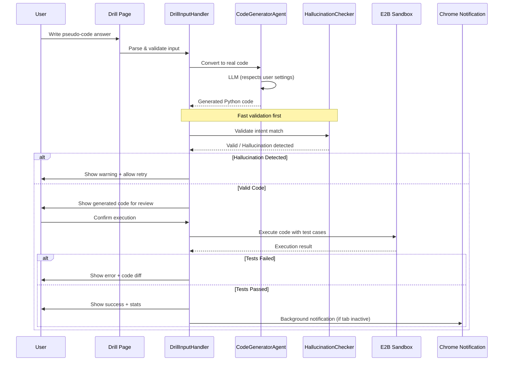

# Epic 11: Enhanced Muscle-Memory Drills

> **Goal:** Allow users to answer drills using natural language/pseudo-code, with AI verification of correctness.

---

## Problem Statement

Current drill system only supports exact-match answers (fill-in-blank, spot-bug). For **muscle-memory drills** where users write code from scratch, we need:

1. Accept pseudo-code or natural language descriptions
2. Convert to real code via LLM
3. Verify correctness via sandbox execution
4. Handle hallucinations gracefully

---

## Architecture Overview



---

## Component Design

### 1. DrillInputHandler (`drill_input_handler.js`)

**Responsibilities:**
- Accept multi-format input (pseudo-code, natural language, audio transcript)
- Basic syntax highlighting for pseudo-code
- Input validation before sending to AI

**Interface:**
```javascript
const DrillInputHandler = {
    // Parse user input into structured format
    parseInput(rawInput, inputType) -> { type, content, hints }
    
    // Validate input is meaningful
    validate(parsedInput) -> { valid: boolean, errors: string[] }
    
    // Get input from the UI
    getInputFromUI(container) -> string
    
    // Render input area with syntax highlighting
    renderInputArea(container, options) -> void
};
```

**Input Types:**
| Type | Description | Priority |
|------|-------------|----------|
| `pseudo-code` | Structured pseudo-code with indentation | P0 |
| `natural-language` | Plain English description | P0 |
| `audio` | Web Speech API transcript | P1 (future) |

---

### 2. CodeGeneratorAgent (`code_generator_agent.js`)

**Responsibilities:**
- Convert pseudo-code/NL to executable Python
- Maintain context from the original drill prompt
- Handle retry logic for generation failures
- **Reuse `llm_sidecar.js::callLLM()` to respect user's model selection**

**Interface:**
```javascript
const CodeGeneratorAgent = {
    // Convert pseudo-code to real Python
    // Uses user's configured model (Gemini/GPT/Anthropic/Local)
    async generateCode(pseudoCode, context) -> {
        code: string,
        language: 'python',
        confidence: number  // 0-1
    }
    
    // Get the prompt for conversion
    buildPrompt(input, drillContext) -> string
};
```

**Implementation Strategy:**
- Import `callLLM` from `llm_sidecar.js` (exposed globally)
- Automatically uses user's selected provider (cloud or local)
- No hardcoded model dependencies

**LLM Prompt Template:**
```
You are a code translator. Convert the following pseudo-code/description into working Python code.

**Drill Context:** {drill.content}
**Expected Pattern:** {drill.skillId}

**User's Answer:**
{userInput}

Rules:
1. Output ONLY valid Python code, no explanations
2. Use the same variable names if mentioned
3. Handle edge cases (empty input, null)
4. Keep the code minimal and focused
5. Return ONLY the code between triple backticks

```python
```

---

### 3. SandboxExecutor (reuse `mcp-server`)

**Responsibilities:**
- Execute generated code in E2B sandbox
- Run test cases against the generated code
- Return execution logs

**Reuse Strategy:**
- **Phase 1 (MVP)**: Use existing `/verify` endpoint (already supports list of test cases ✓)
- **Phase 2 (Optional)**: Add `/execute-drill` endpoint for drill-specific features

**MVP Implementation:**
```javascript
// Use existing /verify endpoint
const result = await fetch('http://localhost:8000/verify', {
    method: 'POST',
    headers: { 'Content-Type': 'application/json' },
    body: JSON.stringify({
        code: generatedCode,
        test_input: drill.test_cases[0] // Or iterate through all
    })
});
```

**Future `/execute-drill` Endpoint (Optional):**
```python
@app.post("/execute-drill")
async def execute_drill(request: DrillExecutionRequest):
    """
    Drill-specific execution with partial credit, hints, etc.
    
    Request:
        - code: str (generated Python)
        - test_cases: list[str]
        - drill_id: str
    
    Response:
        - passed: bool
        - results: list[TestResult]
        - partial_credit: float  # 0-1
        - hint: str | None
    """
```

---

### 4. HallucinationChecker (`hallucination_checker.js`)

**Responsibilities:**
- Detect when LLM generates code that doesn't match user intent
- Flag suspicious patterns (irrelevant imports, unrelated algorithms)
- Suggest corrections

**Interface:**
```javascript
const HallucinationChecker = {
    // Check if generated code matches user intent
    async check(userInput, generatedCode, drillContext) -> {
        isHallucination: boolean,
        confidence: number,
        reason: string | null,
        suggestion: string | null
    }
};
```

**Detection Strategies:**
1. **Keyword matching**: Does generated code contain key terms from pseudo-code?
2. **Algorithm mismatch**: Is the algorithm family correct (e.g., BFS vs DFS)?
3. **Complexity check**: Is generated solution way more complex than expected?

---

### 5. AsyncNotifier (`async_notifier.js`)

**Responsibilities:**
- Show Chrome notification when drill evaluation completes in background
- Link back to drill page

**Interface:**
```javascript
const AsyncNotifier = {
    // Show completion notification
    notify(drillId, result) -> void
    
    // Check if notifications are enabled
    isEnabled() -> boolean
};
```

**Notification Content:**
```
✅ Drill Complete!
Your "Binary Search" drill was evaluated.
Result: Passed (3/3 tests)

[View Details]
```

---

## Data Flow

```
User Input (pseudo-code)
    │
    ▼
┌─────────────────────────┐
│  DrillInputHandler      │
│  - Parse & validate     │
│  - Basic sanitization   │
└───────────┬─────────────┘
            │
            ▼
┌─────────────────────────┐
│  CodeGeneratorAgent     │
│  - Build LLM prompt     │
│  - Call user's model    │
│  - Extract code         │
└───────────┬─────────────┘
            │
            ▼
┌─────────────────────────┐
│  HallucinationChecker   │
│  - Validate intent      │
│  - Check complexity     │
│  - Flag mismatches      │
└───────────┬─────────────┘
            │
        ┌───┴───┐
        │ Valid │
        └───┬───┘
            │
            ▼
┌─────────────────────────┐
│  User Confirmation      │
│  - Show generated code  │
│  - Allow approval       │
└───────────┬─────────────┘
            │
        ┌───┴─────┐
        │ Approve │
        └───┬─────┘
            │
            ▼
┌─────────────────────────┐
│  SandboxExecutor        │
│  - Run test cases       │
│  - Return detailed logs │
└───────────┬─────────────┘
            │
            ▼
┌─────────────────────────┐
│  DrillPage UI           │
│  - Show pass/fail       │
│  - Code diff view       │
│  - Stats & feedback     │
└─────────────────────────┘
```

---

## UI Mockups

### Pseudo-code Input Area

```
┌─────────────────────────────────────────────────────┐
│  Write your solution (pseudo-code or description):  │
├─────────────────────────────────────────────────────┤
│  ┌───────────────────────────────────────────────┐  │
│  │ function binarySearch(arr, target):           │  │
│  │   left = 0, right = len(arr) - 1             │  │
│  │   while left <= right:                        │  │
│  │     mid = (left + right) / 2                  │  │
│  │     if arr[mid] == target: return mid         │  │
│  │     elif arr[mid] < target: left = mid + 1    │  │
│  │     else: right = mid - 1                     │  │
│  │   return -1                                   │  │
│  └───────────────────────────────────────────────┘  │
│                                                     │
│  [✨ Evaluate with AI]                              │
└─────────────────────────────────────────────────────┘
```

### Result View (Success)

```
┌─────────────────────────────────────────────────────┐
│  ✅ Correct!                                        │
├─────────────────────────────────────────────────────┤
│  Your pseudo-code was converted and tested:        │
│                                                     │
│  Generated Code:                                    │
│  ┌───────────────────────────────────────────────┐  │
│  │ def binary_search(arr, target):               │  │
│  │     left, right = 0, len(arr) - 1             │  │
│  │     while left <= right:                       │  │
│  │         mid = (left + right) // 2              │  │
│  │         if arr[mid] == target:                 │  │
│  │             return mid                         │  │
│  │         ...                                    │  │
│  └───────────────────────────────────────────────┘  │
│                                                     │
│  Tests: ✅ 3/3 passed                               │
│  Time: 1.2s                                         │
│                                                     │
│  [Next Drill →]  [Finish]                           │
└─────────────────────────────────────────────────────┘
```

---

## Test Plan

### Unit Tests (TDD)

| Module | Test Cases |
|--------|------------|
| DrillInputHandler | Parse pseudo-code, validate empty input, handle malformed input |
| CodeGeneratorAgent | Generate from pseudo-code, handle LLM errors, validate confidence |
| HallucinationChecker | Detect mismatch, pass valid code, handle edge cases |
| AsyncNotifier | Show notification, handle disabled state |

### Integration Tests

1. **Full flow**: Pseudo-code → Generated code → Sandbox → Result
2. **Error handling**: LLM timeout, sandbox failure, hallucination detected
3. **Background evaluation**: Tab inactive during evaluation

---

## Implementation Sprints

### Sprint 11.1: Multi-Input Support (2-3 days)
1. [x] **Review existing** `drill_input_handler.js` (already exists in src/drills/)
2. [x] Enhance DrillInputHandler with pseudo-code parsing (`parseInput()`, `_detectType()`)
3. [ ] Enhance Drill Page with mode toggle (pseudo-code vs natural language)
4. [ ] Add basic syntax highlighting (keywords, indentation)
5. [x] Input validation and sanitization (`validate()`)

### Sprint 11.2: AI Judgment Pipeline (3-4 days)
1. [x] Create CodeGeneratorAgent module (`generateCode()`, `generateScaffold()`)
2. [x] Fix DrillGenerator/DrillStore module loading in service worker context
3. [x] Implement Sandbox Execution via existing `/verify` endpoint (`SandboxClient`)
4. [x] Create HallucinationChecker module (keyword matching, algorithm detection, complexity check)
5. [x] Create AsyncNotifier module (Chrome notifications for background completion)
6. [x] Wire pipeline to drill page (`drill_init.js` uses CodeGeneratorAgent)
7. [ ] (Optional) Add `/execute-drill` endpoint for drill-specific features

### Sprint 11.3: Polish & Edge Cases (1-2 days)
1. [ ] Error state UI
2. [ ] Retry logic
3. [ ] Loading states
4. [ ] E2E testing

---

## Risks & Mitigations

| Risk | Mitigation |
|------|------------|
| LLM generates incorrect code | HallucinationChecker + user review before proceeding |
| Sandbox timeout | 5s default timeout, retry once |
| High API costs | Cache similar conversions, rate limit |
| User writes actual Python | Detect and skip conversion step |

---

## Design Decisions (Resolved)

1. **✅ Show generated code before running tests**
   - **Decision**: YES - show code and wait for user approval
   - **Rationale**: Transparency > speed; users can abort if generation is clearly wrong
   - **UX**: Add "Run Tests" button after code generation

2. **✅ Handling ambiguous pseudo-code**
   - **Decision**: Option B - Best-effort + confidence score
   - **Rationale**: Faster feedback loop; user sees if LLM understood correctly
   - **Implementation**: If confidence < 0.7, show warning banner

3. **✅ Audio input priority**
   - **Decision**: P1 (future enhancement)
   - **Rationale**: Text input sufficient for MVP; Web Speech API straightforward to add later

---

## Decision Log

| Date | Decision | Rationale |
|------|----------|-----------|
| 2026-01-30 | Use existing E2B sandbox | Reuse Auto-Fix infrastructure |
| 2026-01-30 | P1 for audio input | Focus on text first, audio is additive |
| 2026-01-30 | Show generated code before testing | Transparency > speed; user approval gate |
| 2026-01-30 | Reuse `/verify` endpoint initially | Already supports list of test cases |
| 2026-01-30 | Use user's configured LLM | Respect settings from llm_sidecar |
| 2026-01-30 | Run HallucinationChecker before Sandbox | Faster feedback on obvious errors |
| 2026-01-30 | Add notifications permission | Enable AsyncNotifier for background completion |
